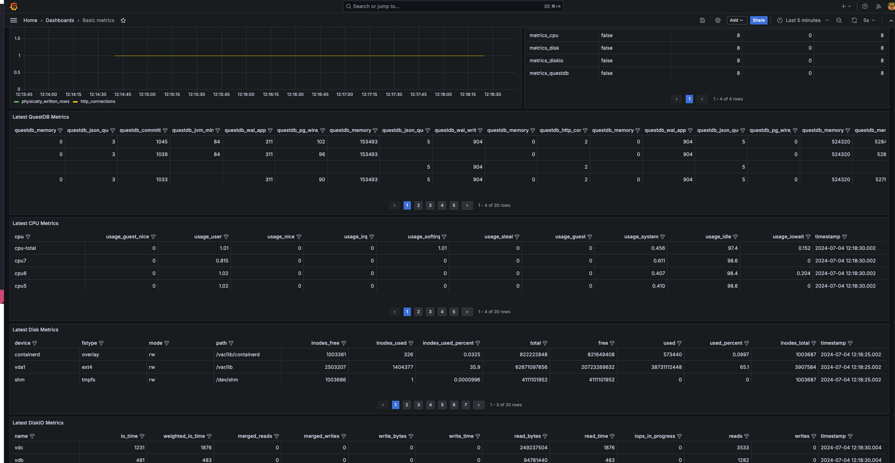

# QuestDB Basic Monitoring

This project collects metrics from a QuestDB instance using the prometheus endpoint, and from the host machine using
the Telegraf CPU, Disk, and DiskIO inoput plugins. It stores all the metrics in QuestDB tables (it can be on a
different QuestDB instance), and provides a grafana dashboard to monitor all the metrics, also including WAL table
metadata.

## Dependencies

You will need docker and docker-compose. If you want to monitor an external QuestDB instance, then you also need
a running QuestDB, but this project starts a QuestDB that you can use and store the metrics within the same instance.

The project will mount the local `qdb_root` folder as the QuestDB root for the dockerized instance. It will also mount
the `grafana` folder to store local grafana data. It also mounts the host filesystem as read-only to collect monitoring
metrics from /etc, /proc, /sys, /var, and /run, as seen as the [telegraf docs](https://github.com/influxdata/telegraf/blob/master/docs/FAQ.md#q-how-can-i-monitor-the-docker-engine-host-from-within-a-container).

## Launching the project

`docker-compose up`

QuestDB will run at http://localhost:9000. Grafana will run at ttp://localhost:3000, with user `admin` and password
`quest`. You can change the credentials by modifying the file `grafana/etc_grafana/grafana.ini`.

If you want to monitor an external questdb instance, please check the environment variable `QUESTDB_METRICS_ENDPOINT` on
 the `telegraf` section of the `docker-compose` file, and also change the `*_METADATA_*` env variables at the `grafana`
 section to point to your source instance.

 If you want to store the metrics into an external questdb instance, please check the last three env variables on the
 `telegraf` section of the `docker-compose` file, and also change the last 6 environment variables at the `grafana`
 section, which point to the connection where to read metrics data from.

For example, the following command will collect metrics and metadata from the machine exposing metrics in port 19003 and
will store them in the QuestDB machine available at http://host.docker.internal:29000. It will create two grafana
connections, one to the original machine with pgwire port at 9912 (for metadata queries), and one at the target metrics
machine with pgwire port at 7712.

```bash
QUESTDB_METRICS_ENDPOINT=http://host.docker.internal:19003 \
QDB_CLIENT_METADATA_HOST=host.docker.internal \
QDB_CLIENT_METADATA_PORT=9912 \
QUESTDB_HTTP_ENDPOINT=http://host.docker.internal:29000 \
QDB_CLIENT_HOST=host.docker.internal \
QDB_CLIENT_PORT=7712 \
docker-compose up
```

## Querying the metrics

If you connect to the questdb metrics storage instance console (if using the default configuration it will be at
http://localhost:9000), you should see four tables with metrics data: `metrics_cpu`,
`metrics_disk`, `metrics_diskio`, and `metrics_questdb`.

If you want to check the dashboard, visit http://localhost:3000/d/basic-metrics. The
default use is `admin` and default password is `quest`. The dashboard is meant to be a
minimal dashboard for inspiration. If you want to modify it, you will need to save a
copy as the demo dashboard, as it is read-only.



## Stopping the project

To just stop the project

`docker-compose down`

To stop the project and remove docker volume info

`docker-compose down -v`

To remove the data generated by QuestDB and Grafana

`rm -rf questdb_root/*`

`rm -rf grafana/home_dir/var_lib_grafana/grafana.db`


